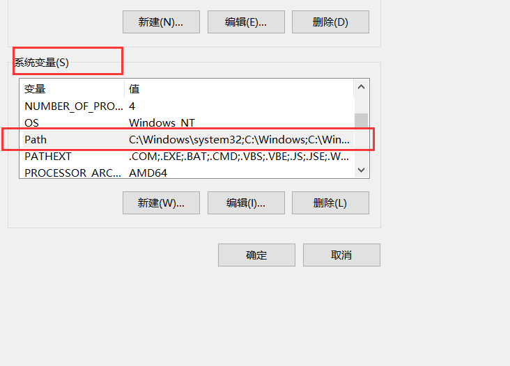
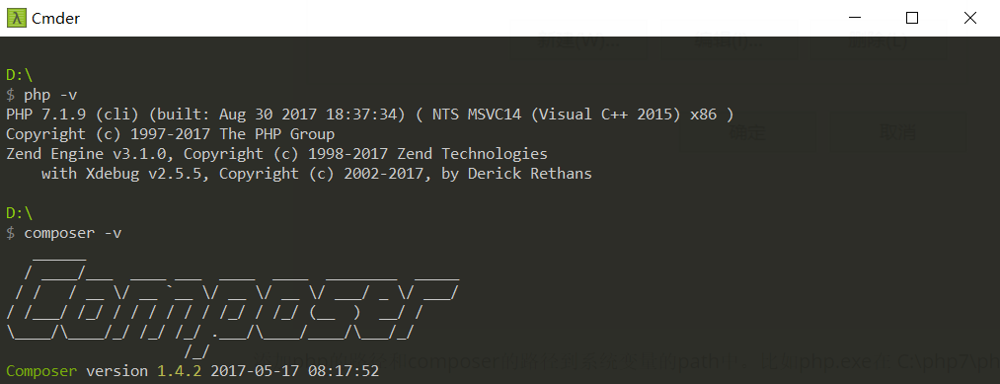

## composer安装和使用教程

> Composer 是 PHP5.3以上 的一个依赖管理工具。它允许你声明项目所依赖的代码库，它会在你的项目中为你安装他们。Composer 不是一个包管理器。是的，它涉及 "packages" 和 "libraries"，但它在每个项目的基础上进行管理，在你项目的某个目录中（例如 vendor）进行安装

composer就是利用php在cli模式下就行工作的一个程序。所以首选先配置**php的环境变量**和打开php的**openssl**拓展库、以及下载和配置composer到系统环境变量中。composer可以使用一键安装。由于国内q的存在。推荐下载phpar 然后配置环境变量的方式。

### 1.下载和配置环境变量
下载该项目中的文件。在bin目录中有三个文件composer、composer.phpar、composer.bat
composer、composer.bat是针对linux、windows平台下面的环境变量的脚本。composer.phpar是将php程序打包的一个文件。composer 命令的原理就是用php在cli下执行composer.phpar 根据后面的参数然后下载不同的依赖。

### 2. 配置windows系统环境

windows配置系统环境变量。右击**我的电脑**， 选择**属性**，然后点击**高级系统设置**，最后点击环境变量就能看到环境变量的配置的地方了。

在系统变量中。找到Path。然后双击即可编辑。



添加php的路径和composer的路径到系统变量的path中。比如php.exe在 C:\php7\php.exe 把 **C:\php7\ ** 加入到path中。每个路径用 **;**隔开。把composer.bat或者composer所在目录也加到系统变量中的path中。

比如 **C:\composer\;C:\php7\;**  

重新打开一个cmd窗口。使用php -v 检测环境变量是否生效。

如果看到上面的画面。说明composer已经成功了。因为国外镜像非常慢。所以下一步就是配置国内镜像。

### 3. 配置国内镜像源

全局配置

```powershell
composer config -g repo.packagist composer https://packagist.phpcomposer.com
```
配置完成就可以使用composer了。

### 4 . composer常用命令介绍

composer的命令很多。可以使用`composer list` 命令查看所有的命令。但是我们需要掌握常用的命令就可以了

- **composer require** 最常用命令。就是需要的依赖程序。

```
 composer require monolog/monolog
```

- **composer update  [package名字 ]** 更新依赖

  如果后面不加package的名字。则是更新当前目录下的package.json的所有依赖。

```
 composer update monolog/monolog
```

- **composer dumpautoload** 更新composer中的classmap 

  如果你更改了很多文件。需要composer自动加载的。你可以使用该命令重新生成classmap的文件。

- **composer install** 根据当前的package.json 下载依赖

